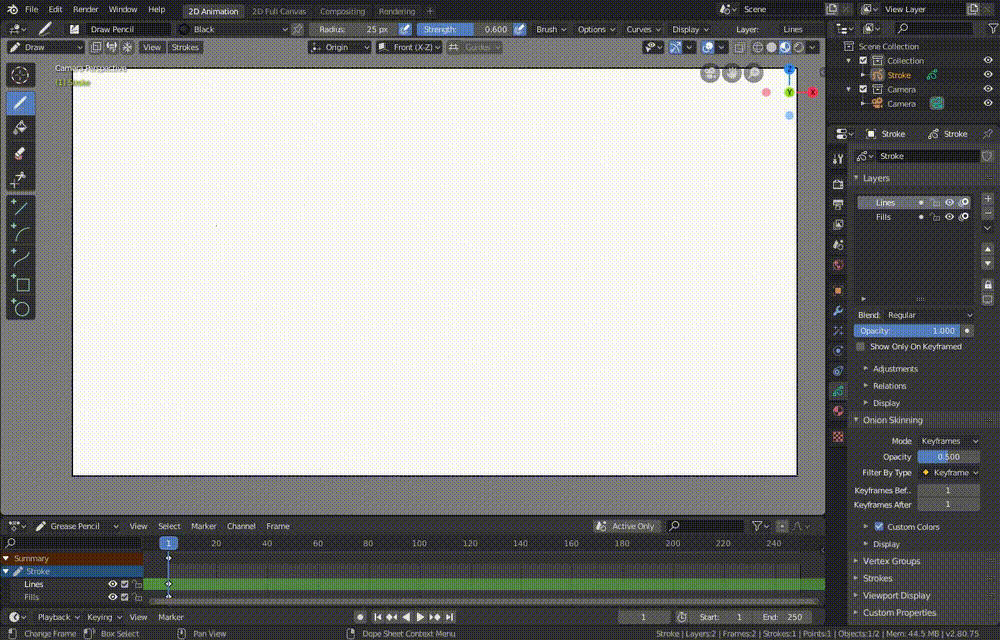

# ToggleMMBRotate
An extreamly simple Blender 2.80 plugin for toggling between rotation and
panning with middle mouse button (useful when working with both 2d and 3d)

## Instalation
In Blender go to `Edit → Preferences → Add-ons → Install...` then choose
the add-on file and then click `Install Add-on from File...`

Then find the "3D View: Toggle MMB Rotate" in the add-ons list and enable
it by checking the check-box.

## Usage
Just hit `F3` (or `spacebar` if your `Spacebar Action` is set to `Search`)
and find the plugin (typing `mm` finds it in most cases and is fast) and hit
enter. You'll see confirmation either `mmb rotate on` or `mmb rotate off`
at the bottom of the app.

## Configuration
By default no keybinding is provided but if you want one just add it under
`3D View → 3D View (Global)` with id `view3d.toggle_mmb_rotate` - don't forget
to `Save Preferences`.

## Preview

